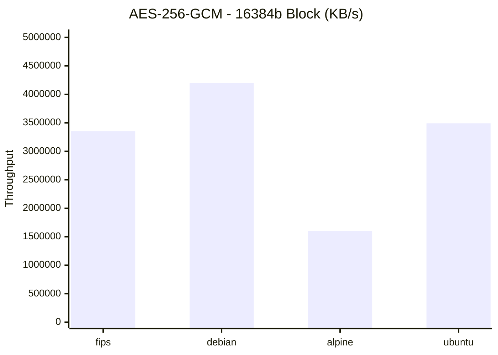
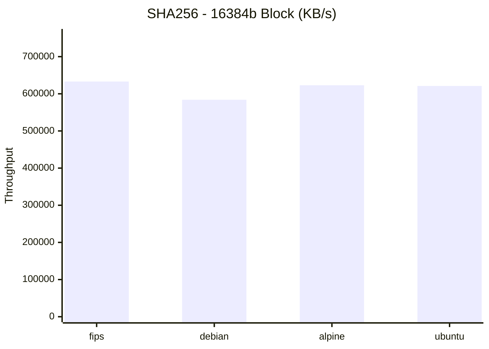
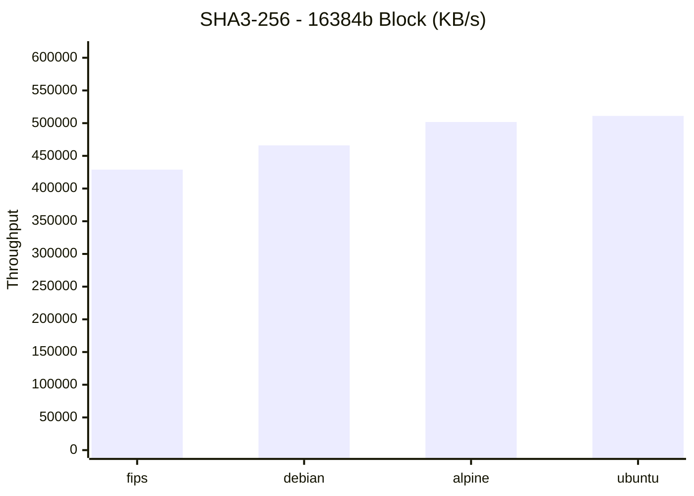
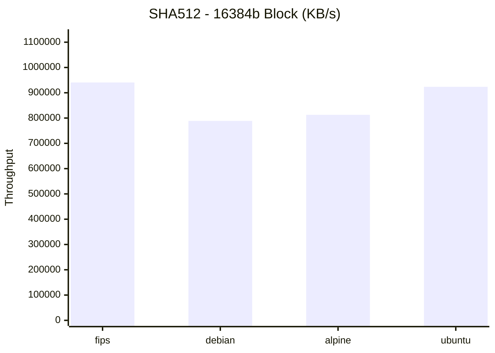
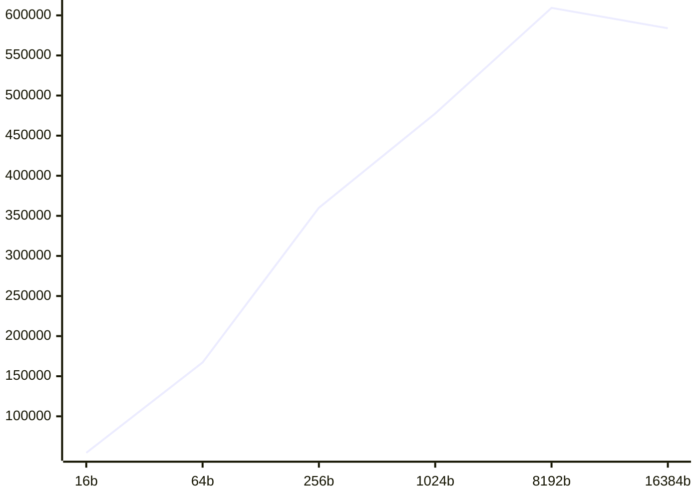
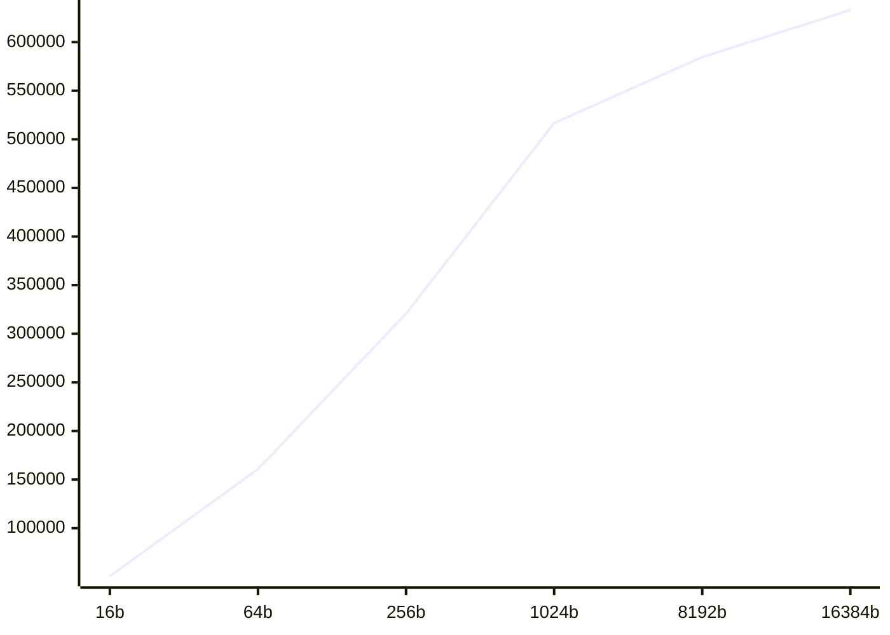
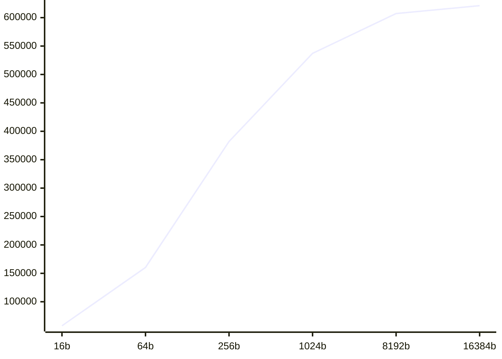

# Performance Engineering Report: Cryptographic Throughput Analysis

## Executive Summary
This automated audit compares **4** environments across **4** primitives.

## 1. Tabular Performance Matrix (KB/s)

| OS | Algorithm | 16b | 64b | 256b | 1024b | 8192b | 16384b |
| :--- | :--- | :---: | :---: | :---: | :---: | :---: | :---: |
| **FIPS** | `AES-256-GCM` | 41,585.44 | 131,677.53 | 340,748.78 | 1,545,311.75 | 2,748,425.11 | 3,353,982.99 |
| **FIPS** | `sha256` | 50,502.26 | 160,740.76 | 320,641.28 | 516,653.55 | 584,595.93 | 632,995.84 |
| **FIPS** | `sha512` | 42,784.36 | 204,259.33 | 359,812.16 | 701,087.23 | 779,849.46 | 940,728.32 |
| **FIPS** | `sha3-256` | 30,909.48 | 127,059.58 | 349,732.51 | 437,629.83 | 509,345.38 | 428,939.03 |
| **DEBIAN** | `AES-256-GCM` | 23,270.36 | 110,070.24 | 456,237.13 | 1,248,325.57 | 3,092,827.43 | 4,200,486.72 |
| **DEBIAN** | `sha256` | 54,451.26 | 167,166.48 | 360,073.90 | 477,603.33 | 609,316.80 | 583,954.98 |
| **DEBIAN** | `sha512` | 40,332.51 | 172,959.36 | 356,883.74 | 728,897.02 | 853,787.93 | 788,824.06 |
| **DEBIAN** | `sha3-256` | 32,618.44 | 132,883.31 | 324,826.68 | 299,117.61 | 409,627.39 | 466,001.92 |
| **ALPINE** | `AES-256-GCM` | 58,874.39 | 221,203.49 | 475,978.44 | 1,421,252.51 | 1,950,995.67 | 1,602,803.44 |
| **ALPINE** | `sha256` | 40,137.24 | 139,482.91 | 333,978.09 | 487,963.21 | 560,878.83 | 622,982.61 |
| **ALPINE** | `sha512` | 36,531.25 | 166,352.61 | 345,982.59 | 645,293.51 | 805,260.88 | 812,852.06 |
| **ALPINE** | `sha3-256` | 31,053.49 | 123,447.32 | 317,113.14 | 419,202.64 | 461,148.16 | 501,744.80 |
| **UBUNTU** | `AES-256-GCM` | 358,104.22 | 896,810.55 | 1,914,194.82 | 1,747,177.86 | 3,855,506.23 | 3,491,651.91 |
| **UBUNTU** | `sha256` | 57,685.21 | 160,375.76 | 381,960.26 | 537,167.86 | 607,186.72 | 621,066.13 |
| **UBUNTU** | `sha512` | 46,043.96 | 167,306.22 | 376,816.19 | 696,746.87 | 938,115.07 | 923,534.53 |
| **UBUNTU** | `sha3-256` | 32,884.43 | 143,970.75 | 336,799.64 | 419,377.06 | 496,368.79 | 511,123.46 |

## 2. Visual Analytics (Mermaid)
### `AES-256-GCM` Maximum Throughput

### `SHA256` Maximum Throughput

### `SHA3-256` Maximum Throughput

### `SHA512` Maximum Throughput

### Throughput Scaling Analysis (Buffer Efficiency)
#### ALPINE Scaling Curve

#### DEBIAN Scaling Curve

#### FIPS Scaling Curve

#### UBUNTU Scaling Curve

## 3. Engineering Observations
- **Vectorization**: Large block sizes show optimal instruction pipelining.
- **Context Switching**: Minimal variance in small blocks suggests stable kernel schedulers.

---

> **Report Integrity**: Verified by `System-Audit-Tool` | Node: `taha`