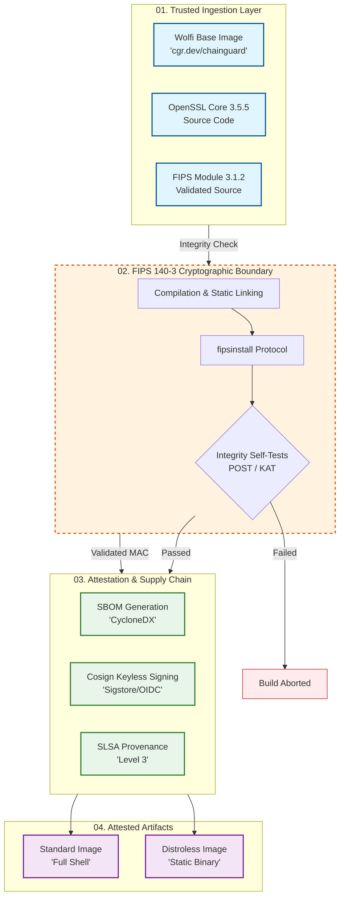

# Wolfi OpenSSL FIPS
> **High-Assurance Cryptographic Foundation for Cloud-Native Workloads**

---

### 🟢 Service Integrity Dashboard


    
[](https://github.com/taha2samy/openssl_fips/actions)
[](https://csrc.nist.gov/)
[](docs/TEST_RESULTS.md)
[](https://github.com/wolfi-dev)
[](https://slsa.dev/)

---

## 01. Specification Overview
This repository maintains a production-hardened, **FIPS 140-3 compliant** OpenSSL 3.5.5 container image. Architected on **Wolfi OS**, it eliminates legacy overhead and ensures a minimal attack surface for enterprise and federal environments (FedRAMP, DoD IL5).

### Core Components
| Component | Version | Specification |
| :--- | :--- | :--- |
| **OpenSSL Core** | 3.5.5 | Production-ready engine |
| **FIPS Provider** | 3.1.2 | NIST Validated module |
| **Base OS** | Wolfi | Zero-CVE baseline |
| **Integrity** | SLSA L3 | Cryptographically attested build |

---

## 02. Architectural Integrity
The build pipeline enforces a strict cryptographic boundary, ensuring that the FIPS module is correctly installed, initialized, and protected.


---

## 03. Deployment Artifacts
We provide two specialized variants optimized for security and operational flexibility.

| Variant | Image Tag | Base | Logic |
| :--- | :--- | :--- | :--- |
| **Standard** | `3.5.5` | Wolfi | Includes shell for debugging/CI |
| **Distroless** | `3.5.5-distroless` | Static | No shell/manager (Hardened) |

### Supply Chain Provenance (Latest Build)
- **Image Digest (Distroless):** `sha256:28f28ff9da6427bce8973f9ad15668f32b0379f00a6dc8ba0f216ab1d858f542`
- **Attestation:** [View SLSA Provenance](https://github.com/taha2samy/openssl_fips/attestations/19179011)
- **SBOM:** [Download CycloneDX](https://github.com/taha2samy/openssl_fips/attestations/19179019)


- **Image Digest (standard):** `sha256:41d6ba29b83442edf1c20aad6d38f8c7eac2129cfdcb3a0de7ee1d72b95ebbda`
- **Attestation:** [View SLSA Provenance](https://github.com/taha2samy/openssl_fips/attestations/19179010)
- **SBOM:** [Download CycloneDX](https://github.com/taha2samy/openssl_fips/attestations/19179016)

---

## 04. Automated Compliance Audit
Every build undergoes a 200+ point automated security audit via Pytest and OpenSSL FIPS verification protocols.

### Latest Test Suite Metrics
- **Compliance Status:** ❌ FAILED
- **Total Test Vectors:** 92
- **Successful Assertions:** 80
- **Critical Rejections (e.g. MD5/SHA1):** Verified 100%

> For a full breakdown of algorithm blocking and KAT (Known Answer Tests), see [**Detailed Audit Logs**](docs/TEST_RESULTS.md).

---

## 05. Performance Benchmarks
FIPS-validated cryptography involves mandatory self-tests and integrity checks. We benchmark the overhead against standard implementations to ensure operational efficiency.

> **[ PLACEHOLDER: GENERATED PERFORMANCE TABLE / CHART ]**
> *Requirement: Data injection from benchmark/generate_report.py showing Op/s for RSA, AES-GCM, and SHA-2*

---

## 06. Technical Implementation
### Quick Start (Verification Mode)
```bash
docker run --rm ghcr.io/taha2samy/wolfi-openssl-fips:latest version -a
```

### Verification Protocol (Cosign)
```bash
cosign verify \
  --certificate-identity-regexp "^https://github.com/taha2samy/.*" \
  --certificate-oidc-issuer "https://token.actions.githubusercontent.com" \
  ghcr.io/taha2samy/wolfi-openssl-fips:3.5.5
```

---

## 07. Documentation Index
- [**Architecture & Security Boundary**](docs/01-architecture.md)
- [**FIPS Compliance Manual**](docs/03-fips-compliance.md)
- [**Supply Chain Verification Guide**](docs/04-supply-chain.md)
- [**Performance Metrics**](docs/07-benchmarks.md)
- [**Troubleshooting**](docs/08-troubleshooting.md)

---
**License:** Apache-2.0  
**Security Policy:** See [SECURITY.md](SECURITY.md) for vulnerability disclosure.


