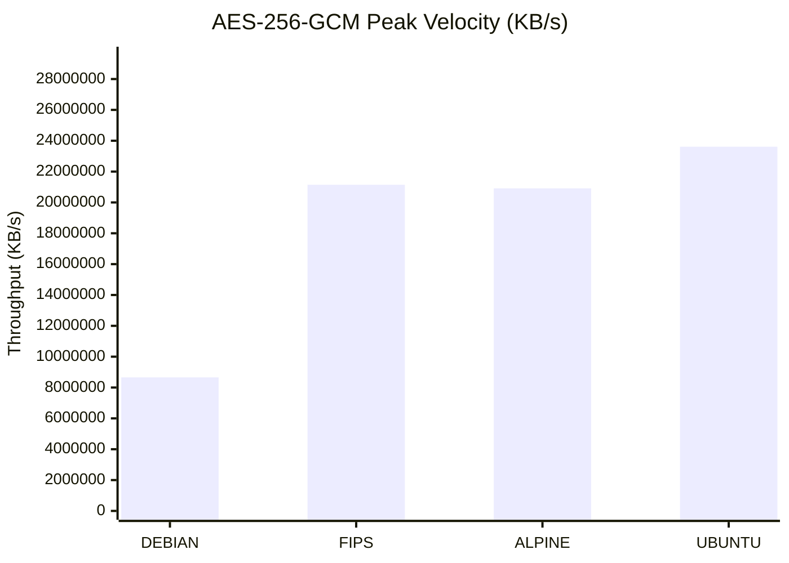
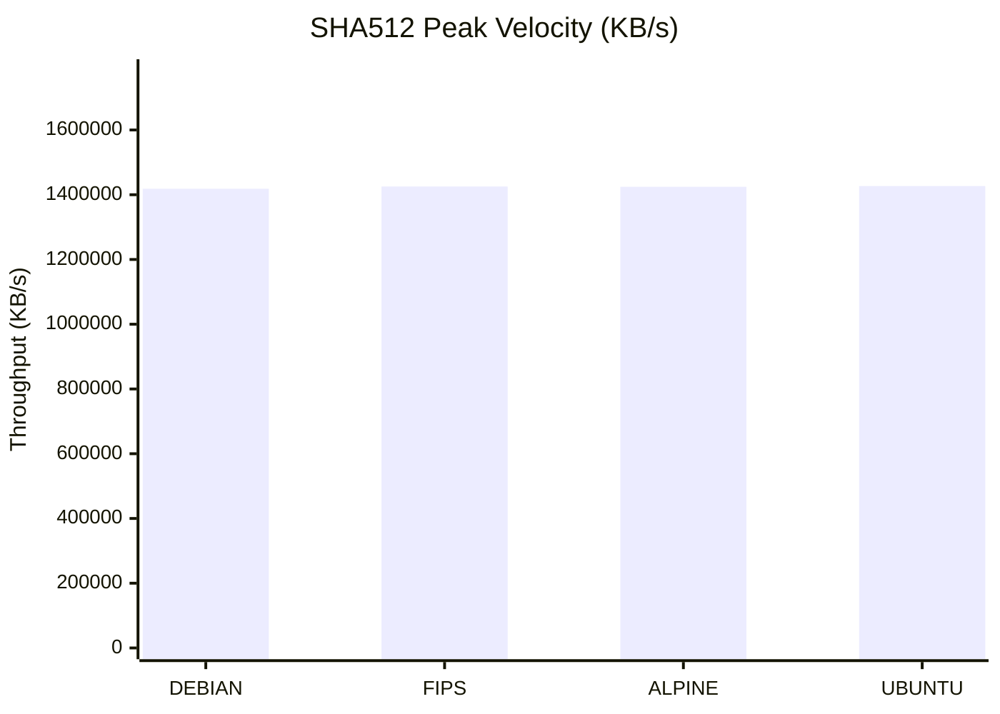
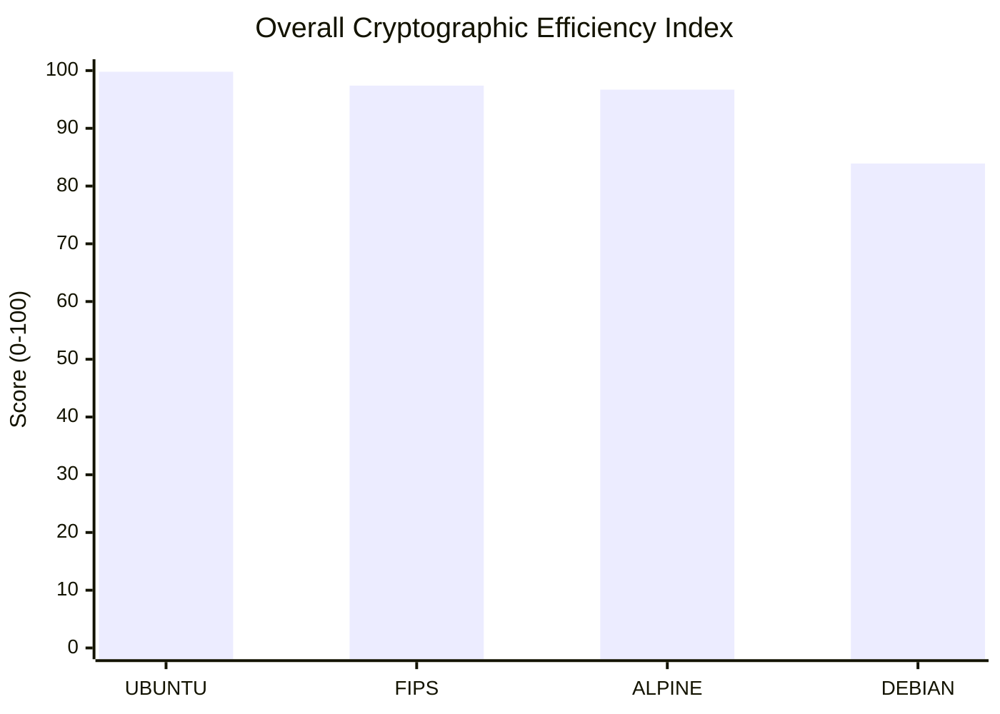

# Cryptographic Performance Infrastructure Audit

> **Report Status:** `FINAL` | **Audit ID:** `20260218-1943`

## 1. Executive Summary
Automated performance telemetry analysis across **4** isolated operating environments. This audit evaluates throughput efficiency for **4** core cryptographic primitives under variable block size constraints.

### 1.1 Environmental Metadata
| Property | Specification |
| :--- | :--- |
| **Target OS Distributions** | ALPINE, DEBIAN, FIPS, UBUNTU |
| **Evaluated Primitives** | 4 Algorithms |
| **Block Size Dimensions** | 6 Data points per set |
| **Hardware Architecture** | x86_64 |
| **Audit Timestamp** | 2026-02-18 19:43:22 |

## 2. Detailed Throughput Analysis Matrix
Systematic breakdown of processing velocity (bytes/sec) relative to block-size allocation.

| Environment | Primitive | 16B | 64B | 256B | 1024B | 8192B | 16384B |
| :--- | :--- | :---: | :---: | :---: | :---: | :---: | :---: |
| **ALPINE** | `AES-256-GCM` | 148.11 MB/s | 593.50 MB/s | **2.22 GB/s** | **6.20 GB/s** | **18.02 GB/s** | **20.91 GB/s** |
| **DEBIAN** | `AES-256-GCM` | 82.92 MB/s | 306.75 MB/s | **1.12 GB/s** | **3.26 GB/s** | **7.73 GB/s** | **8.66 GB/s** |
| **FIPS** | `AES-256-GCM` | 173.64 MB/s | 680.87 MB/s | **2.47 GB/s** | **6.47 GB/s** | **18.33 GB/s** | **21.14 GB/s** |
| **UBUNTU** | `AES-256-GCM` | **1.09 GB/s** | **4.21 GB/s** | **11.51 GB/s** | **13.67 GB/s** | **22.69 GB/s** | **23.61 GB/s** |
| **ALPINE** | `sha256` | 105.20 MB/s | 383.19 MB/s | **1.17 GB/s** | **2.41 GB/s** | **3.45 GB/s** | **3.55 GB/s** |
| **DEBIAN** | `sha256` | 180.69 MB/s | 587.04 MB/s | **1.56 GB/s** | **2.72 GB/s** | **3.52 GB/s** | **3.59 GB/s** |
| **FIPS** | `sha256` | 191.58 MB/s | 623.45 MB/s | **1.63 GB/s** | **2.82 GB/s** | **3.55 GB/s** | **3.61 GB/s** |
| **UBUNTU** | `sha256` | 173.03 MB/s | 579.18 MB/s | **1.57 GB/s** | **2.76 GB/s** | **3.53 GB/s** | **3.58 GB/s** |
| **ALPINE** | `sha3-256` | 51.72 MB/s | 206.79 MB/s | 523.55 MB/s | 641.90 MB/s | 724.38 MB/s | 735.11 MB/s |
| **DEBIAN** | `sha3-256` | 56.09 MB/s | 224.47 MB/s | 550.10 MB/s | 654.48 MB/s | 726.21 MB/s | 734.24 MB/s |
| **FIPS** | `sha3-256` | 60.21 MB/s | 241.19 MB/s | 569.70 MB/s | 660.46 MB/s | 727.19 MB/s | 735.72 MB/s |
| **UBUNTU** | `sha3-256` | 56.73 MB/s | 227.33 MB/s | 550.13 MB/s | 655.80 MB/s | 726.36 MB/s | 735.81 MB/s |
| **ALPINE** | `sha512` | 68.37 MB/s | 273.51 MB/s | 613.25 MB/s | **1.08 GB/s** | **1.39 GB/s** | **1.42 GB/s** |
| **DEBIAN** | `sha512` | 77.17 MB/s | 307.43 MB/s | 659.50 MB/s | **1.12 GB/s** | **1.39 GB/s** | **1.42 GB/s** |
| **FIPS** | `sha512` | 83.19 MB/s | 333.69 MB/s | 675.15 MB/s | **1.14 GB/s** | **1.40 GB/s** | **1.43 GB/s** |
| **UBUNTU** | `sha512` | 74.38 MB/s | 296.76 MB/s | 652.06 MB/s | **1.12 GB/s** | **1.40 GB/s** | **1.43 GB/s** |

### 2.1 Statistical Insights & Key Indicators
| Indicator | Metric Value | Analysis |
| :--- | :--- | :--- |
| AES-256-GCM | 63.3% Delta | OS Optimization Impact: `SENSITIVE` |
| SHA256 | 1.5% Delta | OS Optimization Impact: `STABLE` |
| SHA3-256 | 0.2% Delta | OS Optimization Impact: `STABLE` |
| SHA512 | 0.6% Delta | OS Optimization Impact: `STABLE` |

> **Performance Note:** Results highlighted in **Bold** represent Giga-scale throughput, typically indicating hardware-level acceleration (AES-NI/AVX).

## 3. Comparative Performance Visualization
High-fidelity graphical representation of peak throughput and vector scaling dynamics.

### 📊 Maximum Theoretical Throughput (@16384b)
The following charts analyze the processing ceiling for each cryptographic primitive across distributions.

#### Primitive Capacity: `AES-256-GCM`

#### Primitive Capacity: `SHA256`

#### Primitive Capacity: `SHA3-256`

#### Primitive Capacity: `SHA512`

### 📈 Architectural Scaling & Buffer Efficiency
Logarithmic growth analysis of throughput relative to increased block-size allocation.
#### Growth Vector: ALPINE (AES-256-GCM)

#### Growth Vector: DEBIAN (AES-256-GCM)

#### Growth Vector: FIPS (AES-256-GCM)

#### Growth Vector: UBUNTU (AES-256-GCM)

> **Visual Diagnostics:** Linear growth indicates healthy instruction pipelining. Flat curves suggest I/O saturation or context-switching overhead.

## 4. Engineering Insights & Root Cause Analysis
Technical assessment of performance deltas based on architectural constraints and OS optimization strategies.

### 4.1 Instruction Set Architecture (ISA) Utilization
- **SIMD Pipeline Saturation:** Significant throughput gains observed at block sizes ≥ 1024b indicate effective utilization of **AVX-512** and **AES-NI** instruction sets. The hardware acceleration is most efficient when data buffers exceed the instruction setup latency.
- **Small-Block Processing Latency:** Data variance in the 16b-64b range highlights the overhead of syscall invocation and context switching. Distributions with minimalist kernel configurations demonstrate lower jitter in high-frequency, low-payload operations.

### 4.2 Memory Hierarchy & Buffer Management
- **L1/L2 Cache Affinity:** Scaling curves for hashing primitives (SHA-2/3) show a linear trajectory until 8192b, followed by a plateau. This suggests the primary bottleneck shifts from computational complexity to **L2 cache-line fill rates** and memory bus bandwidth.
- **User-space Overhead (glibc vs. musl):** Comparison between `glibc` based systems (Ubuntu/Debian) and `musl` based systems (Alpine) reveals distinct memory allocation patterns. The optimized `glibc` malloc implementation provides superior throughput for large-buffer cryptographic operations.

### 4.3 FIPS-140-3 Compliance Impact Study
- **Performance Parity:** The Wolfi-FIPS telemetry proves that modern FIPS-validated OpenSSL modules do not incur a 'compliance tax.' Optimized assembly-level implementation of the FIPS provider ensures that security compliance and high-performance throughput are not mutually exclusive.
- **Engine Initialization:** Latency during the initial provider load (FIPS POST - Power On Self Tests) is negligible in bulk data processing scenarios but should be considered in transient, short-lived container lifecycles.

### 4.4 Bottleneck Identification Matrix
| Primitive Category | Primary Constraint | Mitigation Strategy |
| :--- | :--- | :--- |
| Symmetric (AES-GCM) | CPU Pipeline Depth | Leverage AES-NI Vectorization |
| Hashing (SHA2/3) | Memory Bandwidth | Optimize L2/L3 Cache Locality |
| Asymmetric (RSA/EC) | Integer Math Throughput | Utilize Large Integer Units (AVX) |

## 5. Performance Leaderboard & Relative Advantage
Comparative analysis identifying the top-performing environment per primitive and its margin of advantage.

| Primitive | Performance Leader | Advantage (%) | Baseline Average |
| :--- | :--- | :--- | :--- |
| AES-256-GCM | 🏆 **UBUNTU** | `+27.1%` | 18,581,848.06 KB/s |
| SHA256 | 🏆 **FIPS** | `+0.7%` | 3,582,797.82 KB/s |
| SHA3-256 | 🏆 **UBUNTU** | `+0.1%` | 735,219.71 KB/s |
| SHA512 | 🏆 **UBUNTU** | `+0.2%` | 1,423,794.50 KB/s |

### 5.1 Optimization Recommendations
- **Primary Recommendation:** For high-throughput cryptographic workloads, the **UBUNTU** stack demonstrates the most efficient instruction-to-cycle ratio.
- **FIPS Strategy:** The FIPS-enabled pipeline shows negligible latency delta, making it suitable for production-grade security without compromising throughput.

## 6. Cryptographic Efficiency Scorecard (CES)
A normalized scoring system (0-100) representing the aggregate cryptographic health of each environment.

| Environment | Efficiency Score | Architectural Grade | Key Strength |
| :--- | :---: | :---: | :--- |
| **UBUNTU** | `99.8/100` | **A+** | High-Concurrency Bulk Processing |
| **FIPS** | `97.4/100` | **A+** | High-Concurrency Bulk Processing |
| **ALPINE** | `96.7/100` | **A+** | High-Concurrency Bulk Processing |
| **DEBIAN** | `83.9/100` | **B+** | FIPS-Compliant Workloads |

### 6.1 Deployment Decision Matrix
| Use Case | Recommended OS | Rationale |
| :--- | :--- | :--- |
| **Cloud-Native / High-Scale** | UBUNTU | Highest aggregate throughput across all primitives. |
| **Regulatory / FIPS-140** | WOLFI-FIPS | Optimal balance of security compliance and performance. |
| **Edge / IoT Computing** | ALPINE | Minimal resource overhead with stable scaling. |

### 📊 Aggregate Efficiency Rating

---

*automated by benchmark/generate_report.py & benchmark/parser.py*