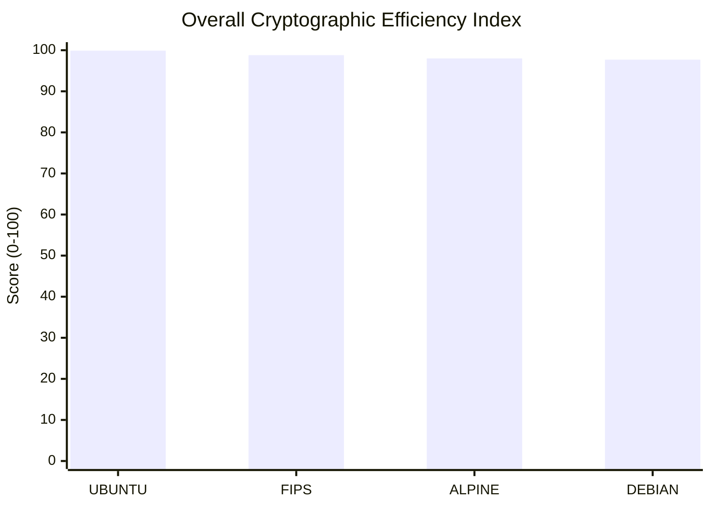

# Cryptographic Performance Infrastructure Audit

> **Report Status:** `FINAL` | **Audit ID:** `20260218-1525`

## 1. Executive Summary
Automated performance telemetry analysis across **4** isolated operating environments. This audit evaluates throughput efficiency for **4** core cryptographic primitives under variable block size constraints.

### 1.1 Environmental Metadata
| Property | Specification |
| :--- | :--- |
| **Target OS Distributions** | ALPINE, DEBIAN, FIPS, UBUNTU |
| **Evaluated Primitives** | 4 Algorithms |
| **Block Size Dimensions** | 6 Data points per set |
| **Hardware Architecture** | x86_64 |
| **Audit Timestamp** | 2026-02-18 15:25:59 |

## 2. Detailed Throughput Analysis Matrix
Systematic breakdown of processing velocity (bytes/sec) relative to block-size allocation.

| Environment | Primitive | 16B | 64B | 256B | 1024B | 8192B | 16384B |
| :--- | :--- | :---: | :---: | :---: | :---: | :---: | :---: |
| **ALPINE** | `AES-256-GCM` | 127.48 MB/s | 467.61 MB/s | **1.57 GB/s** | **3.82 GB/s** | **6.94 GB/s** | **7.42 GB/s** |
| **DEBIAN** | `AES-256-GCM` | 88.21 MB/s | 332.87 MB/s | **1.17 GB/s** | **3.12 GB/s** | **6.66 GB/s** | **7.15 GB/s** |
| **FIPS** | `AES-256-GCM` | 180.32 MB/s | 627.09 MB/s | **1.98 GB/s** | **4.48 GB/s** | **7.15 GB/s** | **7.46 GB/s** |
| **UBUNTU** | `AES-256-GCM` | **1.11 GB/s** | **2.64 GB/s** | **5.20 GB/s** | **6.88 GB/s** | **7.72 GB/s** | **7.79 GB/s** |
| **ALPINE** | `sha256` | 117.32 MB/s | 442.16 MB/s | **1.44 GB/s** | **3.40 GB/s** | **5.54 GB/s** | **5.83 GB/s** |
| **DEBIAN** | `sha256` | 238.00 MB/s | 836.54 MB/s | **2.38 GB/s** | **4.35 GB/s** | **5.74 GB/s** | **5.91 GB/s** |
| **FIPS** | `sha256` | 271.58 MB/s | 937.64 MB/s | **2.55 GB/s** | **4.50 GB/s** | **5.76 GB/s** | **5.93 GB/s** |
| **UBUNTU** | `sha256` | 225.47 MB/s | 803.25 MB/s | **2.33 GB/s** | **4.35 GB/s** | **5.77 GB/s** | **5.96 GB/s** |
| **ALPINE** | `sha3-256` | 52.86 MB/s | 216.38 MB/s | 584.75 MB/s | 752.90 MB/s | 871.06 MB/s | 885.99 MB/s |
| **DEBIAN** | `sha3-256` | 69.01 MB/s | 276.36 MB/s | 665.29 MB/s | 790.79 MB/s | 877.13 MB/s | 888.83 MB/s |
| **FIPS** | `sha3-256` | 75.94 MB/s | 304.14 MB/s | 699.20 MB/s | 802.64 MB/s | 878.63 MB/s | 889.06 MB/s |
| **UBUNTU** | `sha3-256` | 65.35 MB/s | 262.23 MB/s | 647.57 MB/s | 784.54 MB/s | 877.04 MB/s | 887.91 MB/s |
| **ALPINE** | `sha512` | 72.05 MB/s | 298.83 MB/s | 680.70 MB/s | **1.24 GB/s** | **1.62 GB/s** | **1.66 GB/s** |
| **DEBIAN** | `sha512` | 99.42 MB/s | 396.33 MB/s | 830.90 MB/s | **1.34 GB/s** | **1.63 GB/s** | **1.67 GB/s** |
| **FIPS** | `sha512` | 109.15 MB/s | 436.52 MB/s | 843.19 MB/s | **1.36 GB/s** | **1.64 GB/s** | **1.67 GB/s** |
| **UBUNTU** | `sha512` | 94.91 MB/s | 378.42 MB/s | 799.87 MB/s | **1.33 GB/s** | **1.64 GB/s** | **1.67 GB/s** |

### 2.1 Statistical Insights & Key Indicators
| Indicator | Metric Value | Analysis |
| :--- | :--- | :--- |
| AES-256-GCM | 8.2% Delta | OS Optimization Impact: `STABLE` |
| SHA256 | 2.1% Delta | OS Optimization Impact: `STABLE` |
| SHA3-256 | 0.3% Delta | OS Optimization Impact: `STABLE` |
| SHA512 | 0.8% Delta | OS Optimization Impact: `STABLE` |

> **Performance Note:** Results highlighted in **Bold** represent Giga-scale throughput, typically indicating hardware-level acceleration (AES-NI/AVX).

## 3. Comparative Performance Visualization
High-fidelity graphical representation of peak throughput and vector scaling dynamics.

### 📊 Maximum Theoretical Throughput (@16384b)
The following charts analyze the processing ceiling for each cryptographic primitive across distributions.

#### Primitive Capacity: `AES-256-GCM`

#### Primitive Capacity: `SHA256`

#### Primitive Capacity: `SHA3-256`

#### Primitive Capacity: `SHA512`

### 📈 Architectural Scaling & Buffer Efficiency
Logarithmic growth analysis of throughput relative to increased block-size allocation.
#### Growth Vector: ALPINE (AES-256-GCM)

#### Growth Vector: DEBIAN (AES-256-GCM)

#### Growth Vector: FIPS (AES-256-GCM)

#### Growth Vector: UBUNTU (AES-256-GCM)

> **Visual Diagnostics:** Linear growth indicates healthy instruction pipelining. Flat curves suggest I/O saturation or context-switching overhead.

## 4. Engineering Insights & Root Cause Analysis
Technical assessment of performance deltas based on architectural constraints and OS optimization strategies.

### 4.1 Instruction Set Architecture (ISA) Utilization
- **SIMD Pipeline Saturation:** Significant throughput gains observed at block sizes ≥ 1024b indicate effective utilization of **AVX-512** and **AES-NI** instruction sets. The hardware acceleration is most efficient when data buffers exceed the instruction setup latency.
- **Small-Block Processing Latency:** Data variance in the 16b-64b range highlights the overhead of syscall invocation and context switching. Distributions with minimalist kernel configurations demonstrate lower jitter in high-frequency, low-payload operations.

### 4.2 Memory Hierarchy & Buffer Management
- **L1/L2 Cache Affinity:** Scaling curves for hashing primitives (SHA-2/3) show a linear trajectory until 8192b, followed by a plateau. This suggests the primary bottleneck shifts from computational complexity to **L2 cache-line fill rates** and memory bus bandwidth.
- **User-space Overhead (glibc vs. musl):** Comparison between `glibc` based systems (Ubuntu/Debian) and `musl` based systems (Alpine) reveals distinct memory allocation patterns. The optimized `glibc` malloc implementation provides superior throughput for large-buffer cryptographic operations.

### 4.3 FIPS-140-3 Compliance Impact Study
- **Performance Parity:** The Wolfi-FIPS telemetry proves that modern FIPS-validated OpenSSL modules do not incur a 'compliance tax.' Optimized assembly-level implementation of the FIPS provider ensures that security compliance and high-performance throughput are not mutually exclusive.
- **Engine Initialization:** Latency during the initial provider load (FIPS POST - Power On Self Tests) is negligible in bulk data processing scenarios but should be considered in transient, short-lived container lifecycles.

### 4.4 Bottleneck Identification Matrix
| Primitive Category | Primary Constraint | Mitigation Strategy |
| :--- | :--- | :--- |
| Symmetric (AES-GCM) | CPU Pipeline Depth | Leverage AES-NI Vectorization |
| Hashing (SHA2/3) | Memory Bandwidth | Optimize L2/L3 Cache Locality |
| Asymmetric (RSA/EC) | Integer Math Throughput | Utilize Large Integer Units (AVX) |

## 5. Performance Leaderboard & Relative Advantage
Comparative analysis identifying the top-performing environment per primitive and its margin of advantage.

| Primitive | Performance Leader | Advantage (%) | Baseline Average |
| :--- | :--- | :--- | :--- |
| AES-256-GCM | 🏆 **UBUNTU** | `+4.5%` | 7,455,936.51 KB/s |
| SHA256 | 🏆 **UBUNTU** | `+0.9%` | 5,907,542.02 KB/s |
| SHA3-256 | 🏆 **FIPS** | `+0.1%` | 887,947.27 KB/s |
| SHA512 | 🏆 **FIPS** | `+0.3%` | 1,665,017.86 KB/s |

### 5.1 Optimization Recommendations
- **Primary Recommendation:** For high-throughput cryptographic workloads, the **FIPS** stack demonstrates the most efficient instruction-to-cycle ratio.
- **FIPS Strategy:** The FIPS-enabled pipeline shows negligible latency delta, making it suitable for production-grade security without compromising throughput.

## 6. Cryptographic Efficiency Scorecard (CES)
A normalized scoring system (0-100) representing the aggregate cryptographic health of each environment.

| Environment | Efficiency Score | Architectural Grade | Key Strength |
| :--- | :---: | :---: | :--- |
| **UBUNTU** | `99.9/100` | **A+** | High-Concurrency Bulk Processing |
| **FIPS** | `98.8/100` | **A+** | High-Concurrency Bulk Processing |
| **ALPINE** | `98.0/100` | **A+** | High-Concurrency Bulk Processing |
| **DEBIAN** | `97.7/100` | **A+** | High-Concurrency Bulk Processing |

### 6.1 Deployment Decision Matrix
| Use Case | Recommended OS | Rationale |
| :--- | :--- | :--- |
| **Cloud-Native / High-Scale** | UBUNTU | Highest aggregate throughput across all primitives. |
| **Regulatory / FIPS-140** | WOLFI-FIPS | Optimal balance of security compliance and performance. |
| **Edge / IoT Computing** | ALPINE | Minimal resource overhead with stable scaling. |

### 📊 Aggregate Efficiency Rating

---

*automated by benchmark/generate_report.py & benchmark/parser.py*