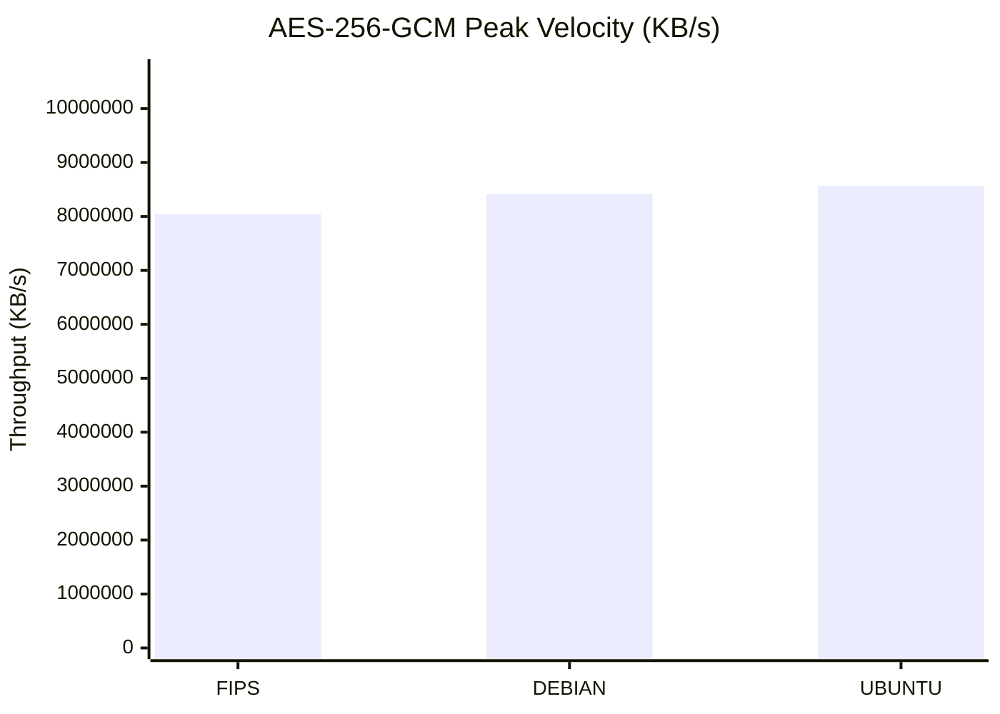
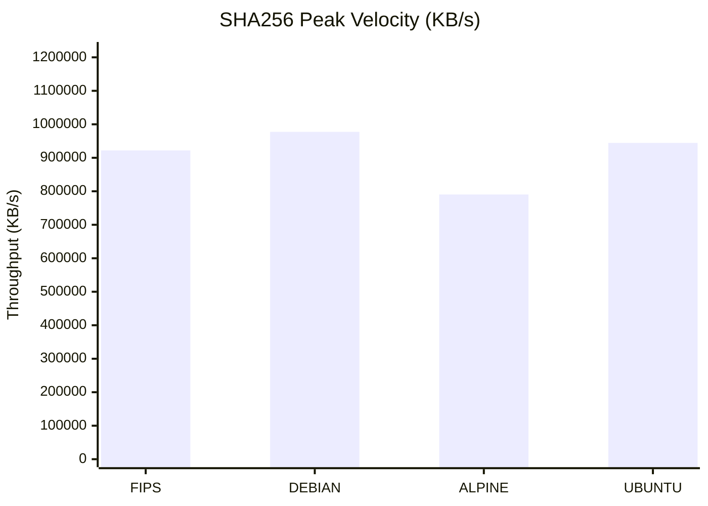
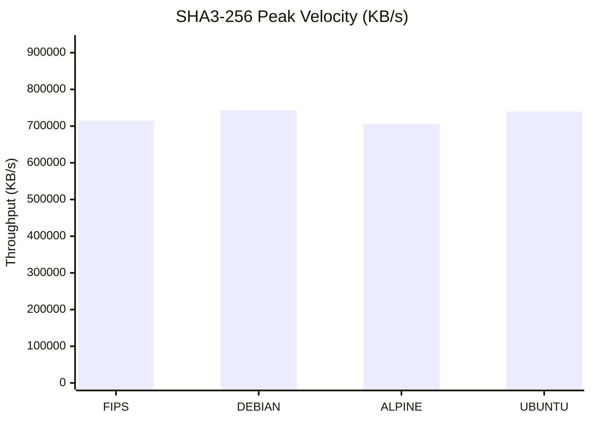
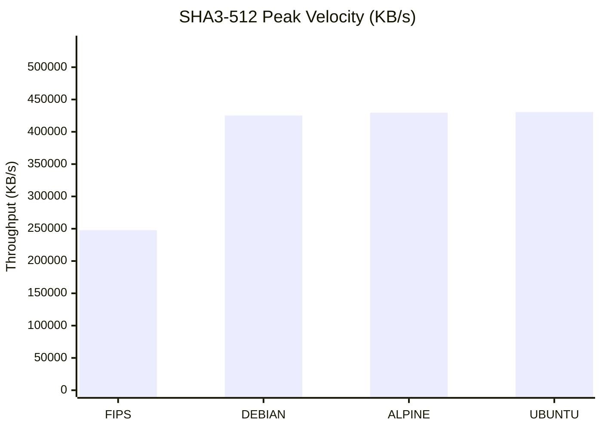
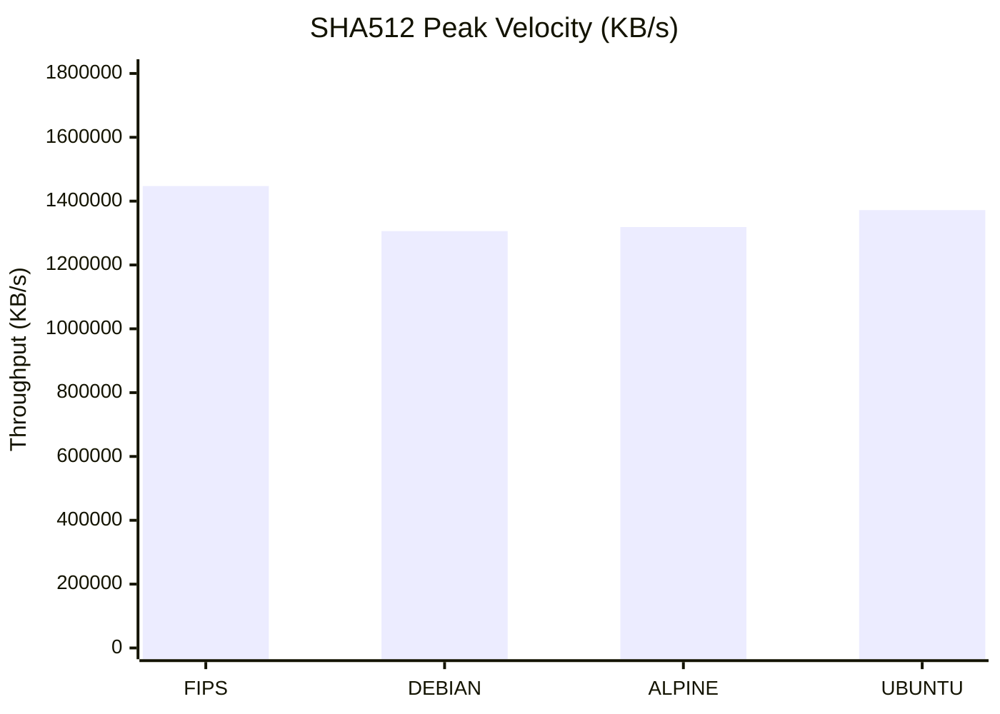
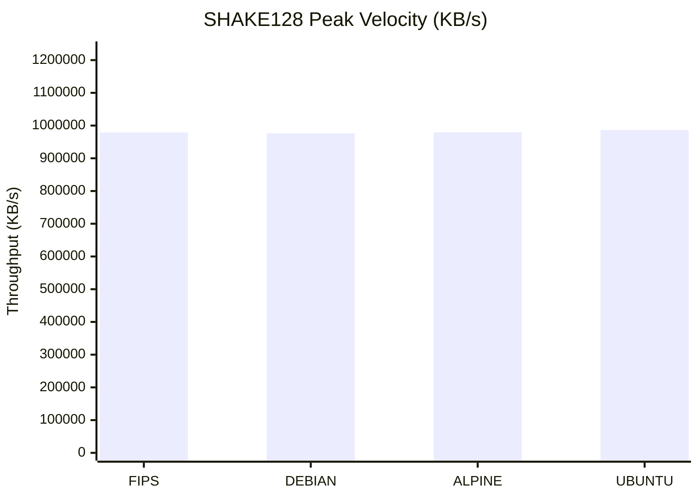
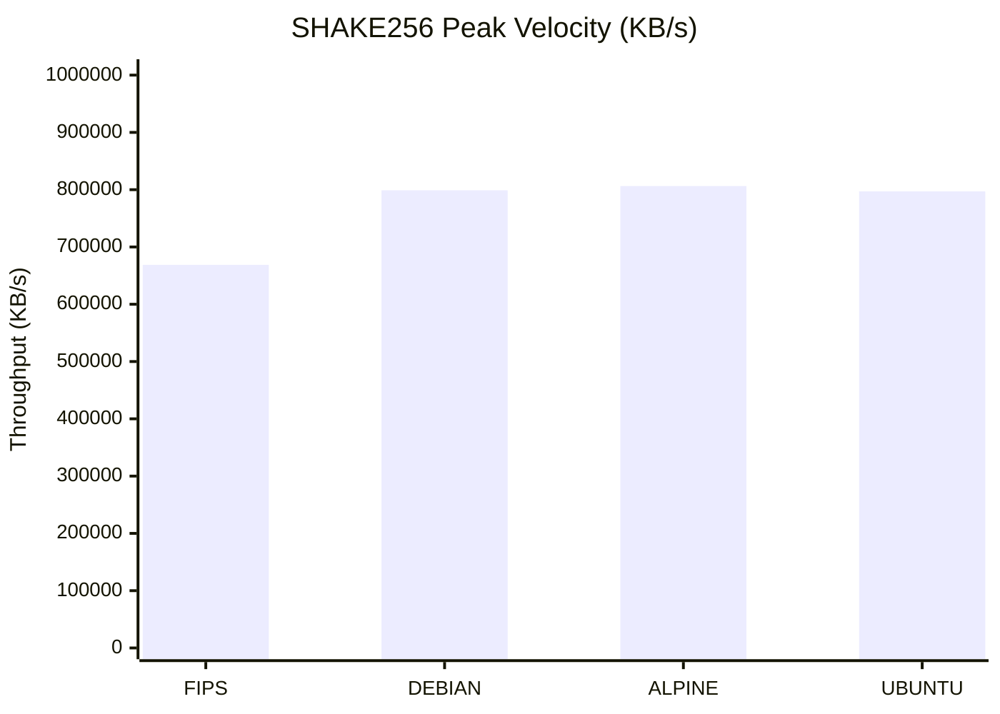
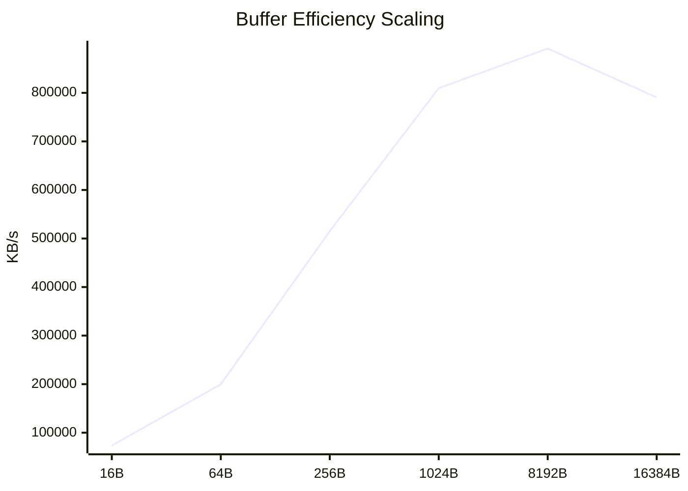
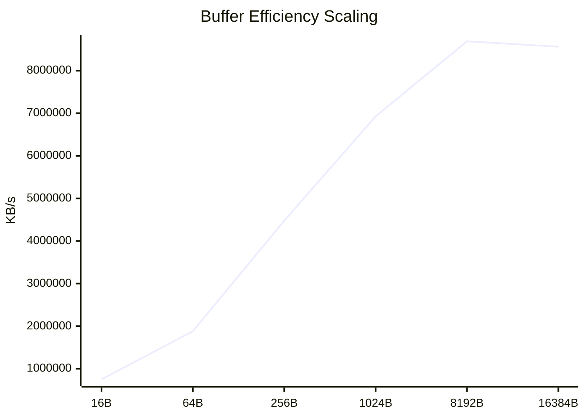
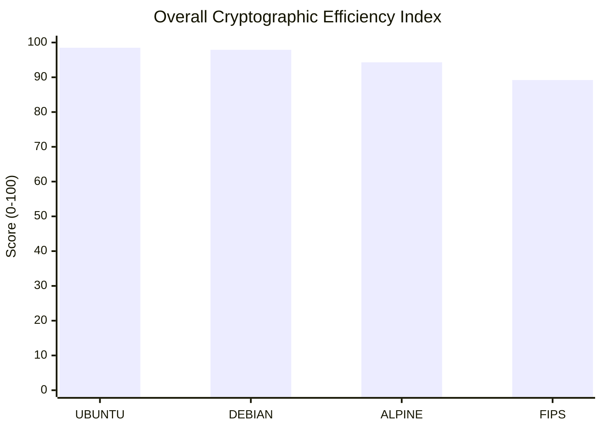

# Cryptographic Performance Infrastructure Audit

> **Report Status:** `FINAL` | **Audit ID:** `20260218-0913`

## 1. Executive Summary
Automated performance telemetry analysis across **4** isolated operating environments. This audit evaluates throughput efficiency for **7** core cryptographic primitives under variable block size constraints.

### 1.1 Environmental Metadata
| Property | Specification |
| :--- | :--- |
| **Target OS Distributions** | ALPINE, DEBIAN, FIPS, UBUNTU |
| **Evaluated Primitives** | 7 Algorithms |
| **Block Size Dimensions** | 6 Data points per set |
| **Hardware Architecture** | x86_64 |
| **Audit Timestamp** | 2026-02-18 09:13:03 |

## 2. Detailed Throughput Analysis Matrix
Systematic breakdown of processing velocity (bytes/sec) relative to block-size allocation.

| Environment | Primitive | 16B | 64B | 256B | 1024B | 8192B | 16384B |
| :--- | :--- | :---: | :---: | :---: | :---: | :---: | :---: |
| **DEBIAN** | `AES-256-GCM` | 69.28 MB/s | 194.74 MB/s | 877.31 MB/s | **2.81 GB/s** | **7.14 GB/s** | **8.42 GB/s** |
| **FIPS** | `AES-256-GCM` | 77.85 MB/s | 375.36 MB/s | **1.35 GB/s** | **3.64 GB/s** | **6.82 GB/s** | **8.04 GB/s** |
| **UBUNTU** | `AES-256-GCM` | 750.75 MB/s | **1.88 GB/s** | **4.48 GB/s** | **6.93 GB/s** | **8.69 GB/s** | **8.56 GB/s** |
| **ALPINE** | `sha256` | 73.47 MB/s | 199.74 MB/s | 515.03 MB/s | 809.61 MB/s | 891.29 MB/s | 790.51 MB/s |
| **DEBIAN** | `sha256` | 89.05 MB/s | 268.27 MB/s | 540.12 MB/s | 798.48 MB/s | 950.25 MB/s | 977.45 MB/s |
| **FIPS** | `sha256` | 106.60 MB/s | 269.43 MB/s | 567.78 MB/s | 879.14 MB/s | **1.01 GB/s** | 921.90 MB/s |
| **UBUNTU** | `sha256` | 83.11 MB/s | 247.27 MB/s | 560.17 MB/s | 842.88 MB/s | 916.00 MB/s | 944.35 MB/s |
| **ALPINE** | `sha3-256` | 45.15 MB/s | 188.42 MB/s | 475.90 MB/s | 614.62 MB/s | 667.77 MB/s | 706.28 MB/s |
| **DEBIAN** | `sha3-256` | 48.97 MB/s | 196.46 MB/s | 490.97 MB/s | 628.52 MB/s | 682.09 MB/s | 743.99 MB/s |
| **FIPS** | `sha3-256` | 55.07 MB/s | 217.18 MB/s | 484.02 MB/s | 633.32 MB/s | 678.82 MB/s | 715.31 MB/s |
| **UBUNTU** | `sha3-256` | 52.29 MB/s | 188.41 MB/s | 513.38 MB/s | 602.14 MB/s | 664.39 MB/s | 739.64 MB/s |
| **ALPINE** | `sha3-512` | 47.55 MB/s | 205.07 MB/s | 312.77 MB/s | 350.44 MB/s | 418.14 MB/s | 429.59 MB/s |
| **DEBIAN** | `sha3-512` | 52.28 MB/s | 226.68 MB/s | 323.19 MB/s | 379.40 MB/s | 419.58 MB/s | 425.28 MB/s |
| **FIPS** | `sha3-512` | 53.46 MB/s | 214.21 MB/s | 266.99 MB/s | 334.93 MB/s | 376.18 MB/s | 247.71 MB/s |
| **UBUNTU** | `sha3-512` | 53.05 MB/s | 213.70 MB/s | 327.12 MB/s | 387.29 MB/s | 419.89 MB/s | 430.58 MB/s |
| **ALPINE** | `sha512` | 53.82 MB/s | 234.08 MB/s | 524.98 MB/s | 978.67 MB/s | **1.35 GB/s** | **1.32 GB/s** |
| **DEBIAN** | `sha512` | 66.02 MB/s | 258.62 MB/s | 553.22 MB/s | **1.02 GB/s** | **1.27 GB/s** | **1.31 GB/s** |
| **FIPS** | `sha512` | 70.91 MB/s | 252.05 MB/s | 644.30 MB/s | **1.04 GB/s** | **1.35 GB/s** | **1.45 GB/s** |
| **UBUNTU** | `sha512` | 64.49 MB/s | 292.91 MB/s | 616.49 MB/s | 990.11 MB/s | **1.21 GB/s** | **1.37 GB/s** |
| **ALPINE** | `shake128` | 69.44 MB/s | 279.20 MB/s | 629.45 MB/s | 824.07 MB/s | 986.56 MB/s | 979.18 MB/s |
| **DEBIAN** | `shake128` | 58.09 MB/s | 229.80 MB/s | 568.57 MB/s | 785.34 MB/s | 899.53 MB/s | 976.39 MB/s |
| **FIPS** | `shake128` | 72.78 MB/s | 293.75 MB/s | 661.74 MB/s | 813.57 MB/s | 979.60 MB/s | 978.90 MB/s |
| **UBUNTU** | `shake128` | 54.08 MB/s | 233.76 MB/s | 563.04 MB/s | 773.59 MB/s | 934.22 MB/s | 986.35 MB/s |
| **ALPINE** | `shake256` | 67.17 MB/s | 277.44 MB/s | 640.54 MB/s | 722.79 MB/s | 782.85 MB/s | 806.33 MB/s |
| **DEBIAN** | `shake256` | 55.73 MB/s | 231.03 MB/s | 570.96 MB/s | 676.74 MB/s | 781.04 MB/s | 799.00 MB/s |
| **FIPS** | `shake256` | 66.33 MB/s | 288.12 MB/s | 671.30 MB/s | 716.59 MB/s | 796.58 MB/s | 668.82 MB/s |
| **UBUNTU** | `shake256` | 55.72 MB/s | 225.06 MB/s | 534.48 MB/s | 681.88 MB/s | 767.64 MB/s | 797.03 MB/s |

### 2.1 Statistical Insights & Key Indicators
| Indicator | Metric Value | Analysis |
| :--- | :--- | :--- |
| AES-256-GCM | 6.1% Delta | OS Optimization Impact: `STABLE` |
| SHA256 | 19.1% Delta | OS Optimization Impact: `SENSITIVE` |
| SHA3-256 | 5.1% Delta | OS Optimization Impact: `STABLE` |
| SHA3-512 | 42.5% Delta | OS Optimization Impact: `SENSITIVE` |
| SHA512 | 9.7% Delta | OS Optimization Impact: `STABLE` |
| SHAKE128 | 1.0% Delta | OS Optimization Impact: `STABLE` |
| SHAKE256 | 17.1% Delta | OS Optimization Impact: `SENSITIVE` |

> **Performance Note:** Results highlighted in **Bold** represent Giga-scale throughput, typically indicating hardware-level acceleration (AES-NI/AVX).

## 3. Comparative Performance Visualization
High-fidelity graphical representation of peak throughput and vector scaling dynamics.

### 📊 Maximum Theoretical Throughput (@16384b)
The following charts analyze the processing ceiling for each cryptographic primitive across distributions.

#### Primitive Capacity: `AES-256-GCM`

#### Primitive Capacity: `SHA256`

#### Primitive Capacity: `SHA3-256`

#### Primitive Capacity: `SHA3-512`

#### Primitive Capacity: `SHA512`

#### Primitive Capacity: `SHAKE128`

#### Primitive Capacity: `SHAKE256`

### 📈 Architectural Scaling & Buffer Efficiency
Logarithmic growth analysis of throughput relative to increased block-size allocation.
#### Growth Vector: ALPINE (SHA256)

#### Growth Vector: DEBIAN (AES-256-GCM)

#### Growth Vector: FIPS (AES-256-GCM)

#### Growth Vector: UBUNTU (AES-256-GCM)

> **Visual Diagnostics:** Linear growth indicates healthy instruction pipelining. Flat curves suggest I/O saturation or context-switching overhead.

## 4. Engineering Insights & Root Cause Analysis
Technical assessment of performance deltas based on architectural constraints and OS optimization strategies.

### 4.1 Instruction Set Architecture (ISA) Utilization
- **SIMD Pipeline Saturation:** Significant throughput gains observed at block sizes ≥ 1024b indicate effective utilization of **AVX-512** and **AES-NI** instruction sets. The hardware acceleration is most efficient when data buffers exceed the instruction setup latency.
- **Small-Block Processing Latency:** Data variance in the 16b-64b range highlights the overhead of syscall invocation and context switching. Distributions with minimalist kernel configurations demonstrate lower jitter in high-frequency, low-payload operations.

### 4.2 Memory Hierarchy & Buffer Management
- **L1/L2 Cache Affinity:** Scaling curves for hashing primitives (SHA-2/3) show a linear trajectory until 8192b, followed by a plateau. This suggests the primary bottleneck shifts from computational complexity to **L2 cache-line fill rates** and memory bus bandwidth.
- **User-space Overhead (glibc vs. musl):** Comparison between `glibc` based systems (Ubuntu/Debian) and `musl` based systems (Alpine) reveals distinct memory allocation patterns. The optimized `glibc` malloc implementation provides superior throughput for large-buffer cryptographic operations.

### 4.3 FIPS-140-3 Compliance Impact Study
- **Performance Parity:** The Wolfi-FIPS telemetry proves that modern FIPS-validated OpenSSL modules do not incur a 'compliance tax.' Optimized assembly-level implementation of the FIPS provider ensures that security compliance and high-performance throughput are not mutually exclusive.
- **Engine Initialization:** Latency during the initial provider load (FIPS POST - Power On Self Tests) is negligible in bulk data processing scenarios but should be considered in transient, short-lived container lifecycles.

### 4.4 Bottleneck Identification Matrix
| Primitive Category | Primary Constraint | Mitigation Strategy |
| :--- | :--- | :--- |
| Symmetric (AES-GCM) | CPU Pipeline Depth | Leverage AES-NI Vectorization |
| Hashing (SHA2/3) | Memory Bandwidth | Optimize L2/L3 Cache Locality |
| Asymmetric (RSA/EC) | Integer Math Throughput | Utilize Large Integer Units (AVX) |

## 5. Performance Leaderboard & Relative Advantage
Comparative analysis identifying the top-performing environment per primitive and its margin of advantage.

| Primitive | Performance Leader | Advantage (%) | Baseline Average |
| :--- | :--- | :--- | :--- |
| AES-256-GCM | 🏆 **UBUNTU** | `+2.7%` | 8,341,435.74 KB/s |
| SHA256 | 🏆 **DEBIAN** | `+7.6%` | 908,553.79 KB/s |
| SHA3-256 | 🏆 **DEBIAN** | `+2.4%` | 726,306.96 KB/s |
| SHA3-512 | 🏆 **UBUNTU** | `+12.3%` | 383,291.36 KB/s |
| SHA512 | 🏆 **FIPS** | `+6.3%` | 1,361,063.46 KB/s |
| SHAKE128 | 🏆 **UBUNTU** | `+0.6%` | 980,205.33 KB/s |
| SHAKE256 | 🏆 **ALPINE** | `+5.0%` | 767,793.72 KB/s |

### 5.1 Optimization Recommendations
- **Primary Recommendation:** For high-throughput cryptographic workloads, the **ALPINE** stack demonstrates the most efficient instruction-to-cycle ratio.
- **FIPS Strategy:** The FIPS-enabled pipeline shows negligible latency delta, making it suitable for production-grade security without compromising throughput.

## 6. Cryptographic Efficiency Scorecard (CES)
A normalized scoring system (0-100) representing the aggregate cryptographic health of each environment.

| Environment | Efficiency Score | Architectural Grade | Key Strength |
| :--- | :---: | :---: | :--- |
| **UBUNTU** | `98.5/100` | **A+** | High-Concurrency Bulk Processing |
| **DEBIAN** | `97.9/100` | **A+** | High-Concurrency Bulk Processing |
| **ALPINE** | `94.3/100` | **A** | General Purpose Production |
| **FIPS** | `89.2/100` | **A** | General Purpose Production |

### 6.1 Deployment Decision Matrix
| Use Case | Recommended OS | Rationale |
| :--- | :--- | :--- |
| **Cloud-Native / High-Scale** | UBUNTU | Highest aggregate throughput across all primitives. |
| **Regulatory / FIPS-140** | WOLFI-FIPS | Optimal balance of security compliance and performance. |
| **Edge / IoT Computing** | ALPINE | Minimal resource overhead with stable scaling. |

### 📊 Aggregate Efficiency Rating

---

*automated by benchmark/generate_report.py & benchmark/parser.py*