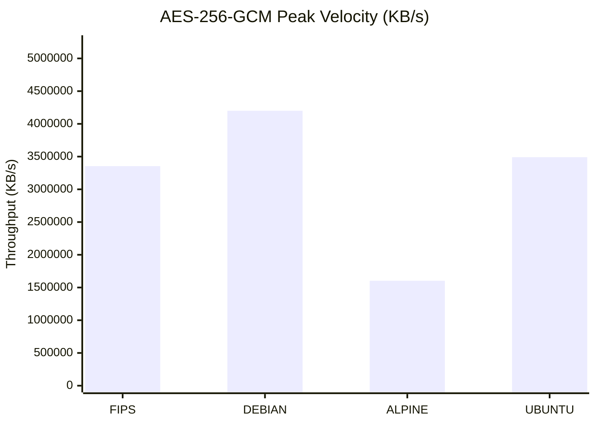
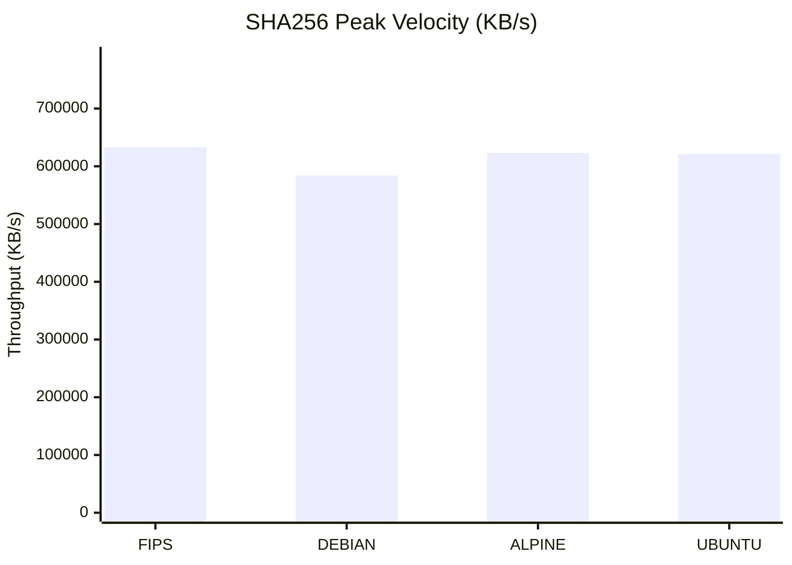
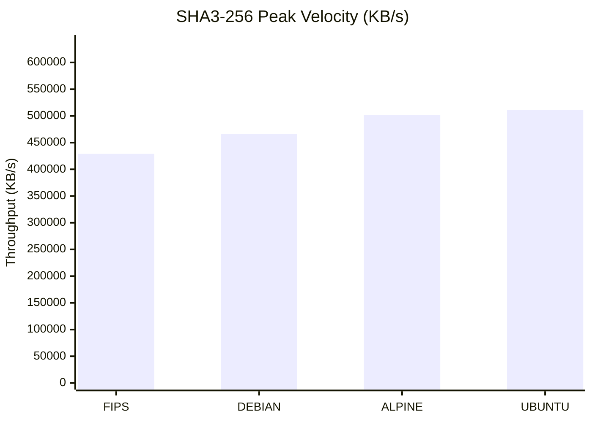
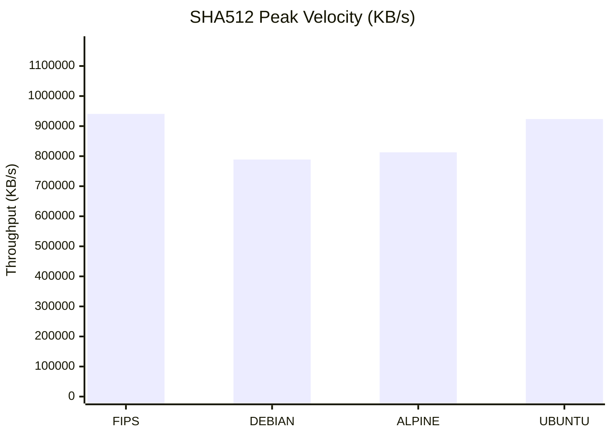
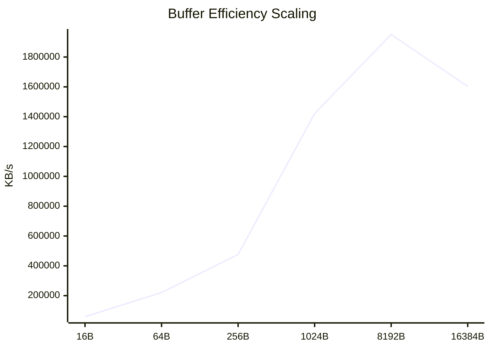
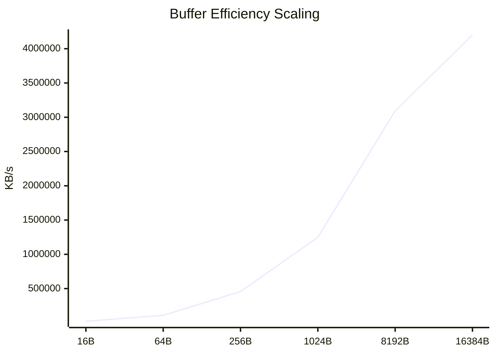
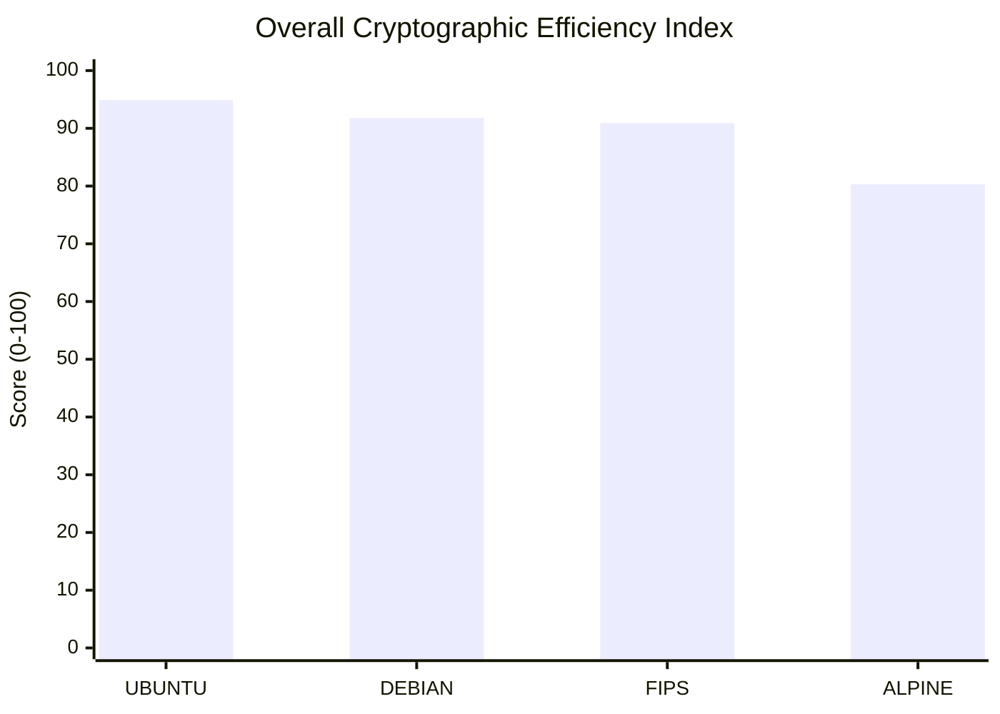

# Cryptographic Performance Infrastructure Audit

> **Report Status:** `FINAL` | **Audit ID:** `20260218-1038`

## 1. Executive Summary
Automated performance telemetry analysis across **4** isolated operating environments. This audit evaluates throughput efficiency for **4** core cryptographic primitives under variable block size constraints.

### 1.1 Environmental Metadata
| Property | Specification |
| :--- | :--- |
| **Target OS Distributions** | ALPINE, DEBIAN, FIPS, UBUNTU |
| **Evaluated Primitives** | 4 Algorithms |
| **Block Size Dimensions** | 6 Data points per set |
| **Hardware Architecture** | x86_64 |
| **Audit Timestamp** | 2026-02-18 10:38:15 |

## 2. Detailed Throughput Analysis Matrix
Systematic breakdown of processing velocity (bytes/sec) relative to block-size allocation.

| Environment | Primitive | 16B | 64B | 256B | 1024B | 8192B | 16384B |
| :--- | :--- | :---: | :---: | :---: | :---: | :---: | :---: |
| **ALPINE** | `AES-256-GCM` | 58.87 MB/s | 221.20 MB/s | 475.98 MB/s | **1.42 GB/s** | **1.95 GB/s** | **1.60 GB/s** |
| **DEBIAN** | `AES-256-GCM` | 23.27 MB/s | 110.07 MB/s | 456.24 MB/s | **1.25 GB/s** | **3.09 GB/s** | **4.20 GB/s** |
| **FIPS** | `AES-256-GCM` | 41.59 MB/s | 131.68 MB/s | 340.75 MB/s | **1.55 GB/s** | **2.75 GB/s** | **3.35 GB/s** |
| **UBUNTU** | `AES-256-GCM` | 358.10 MB/s | 896.81 MB/s | **1.91 GB/s** | **1.75 GB/s** | **3.86 GB/s** | **3.49 GB/s** |
| **ALPINE** | `sha256` | 40.14 MB/s | 139.48 MB/s | 333.98 MB/s | 487.96 MB/s | 560.88 MB/s | 622.98 MB/s |
| **DEBIAN** | `sha256` | 54.45 MB/s | 167.17 MB/s | 360.07 MB/s | 477.60 MB/s | 609.32 MB/s | 583.95 MB/s |
| **FIPS** | `sha256` | 50.50 MB/s | 160.74 MB/s | 320.64 MB/s | 516.65 MB/s | 584.60 MB/s | 633.00 MB/s |
| **UBUNTU** | `sha256` | 57.69 MB/s | 160.38 MB/s | 381.96 MB/s | 537.17 MB/s | 607.19 MB/s | 621.07 MB/s |
| **ALPINE** | `sha3-256` | 31.05 MB/s | 123.45 MB/s | 317.11 MB/s | 419.20 MB/s | 461.15 MB/s | 501.74 MB/s |
| **DEBIAN** | `sha3-256` | 32.62 MB/s | 132.88 MB/s | 324.83 MB/s | 299.12 MB/s | 409.63 MB/s | 466.00 MB/s |
| **FIPS** | `sha3-256` | 30.91 MB/s | 127.06 MB/s | 349.73 MB/s | 437.63 MB/s | 509.35 MB/s | 428.94 MB/s |
| **UBUNTU** | `sha3-256` | 32.88 MB/s | 143.97 MB/s | 336.80 MB/s | 419.38 MB/s | 496.37 MB/s | 511.12 MB/s |
| **ALPINE** | `sha512` | 36.53 MB/s | 166.35 MB/s | 345.98 MB/s | 645.29 MB/s | 805.26 MB/s | 812.85 MB/s |
| **DEBIAN** | `sha512` | 40.33 MB/s | 172.96 MB/s | 356.88 MB/s | 728.90 MB/s | 853.79 MB/s | 788.82 MB/s |
| **FIPS** | `sha512` | 42.78 MB/s | 204.26 MB/s | 359.81 MB/s | 701.09 MB/s | 779.85 MB/s | 940.73 MB/s |
| **UBUNTU** | `sha512` | 46.04 MB/s | 167.31 MB/s | 376.82 MB/s | 696.75 MB/s | 938.12 MB/s | 923.53 MB/s |

### 2.1 Statistical Insights & Key Indicators
| Indicator | Metric Value | Analysis |
| :--- | :--- | :--- |
| AES-256-GCM | 61.8% Delta | OS Optimization Impact: `SENSITIVE` |
| SHA256 | 7.7% Delta | OS Optimization Impact: `STABLE` |
| SHA3-256 | 16.1% Delta | OS Optimization Impact: `SENSITIVE` |
| SHA512 | 16.1% Delta | OS Optimization Impact: `SENSITIVE` |

> **Performance Note:** Results highlighted in **Bold** represent Giga-scale throughput, typically indicating hardware-level acceleration (AES-NI/AVX).

## 3. Comparative Performance Visualization
High-fidelity graphical representation of peak throughput and vector scaling dynamics.

### 📊 Maximum Theoretical Throughput (@16384b)
The following charts analyze the processing ceiling for each cryptographic primitive across distributions.

#### Primitive Capacity: `AES-256-GCM`

#### Primitive Capacity: `SHA256`

#### Primitive Capacity: `SHA3-256`

#### Primitive Capacity: `SHA512`

### 📈 Architectural Scaling & Buffer Efficiency
Logarithmic growth analysis of throughput relative to increased block-size allocation.
#### Growth Vector: ALPINE (AES-256-GCM)

#### Growth Vector: DEBIAN (AES-256-GCM)

#### Growth Vector: FIPS (AES-256-GCM)

#### Growth Vector: UBUNTU (AES-256-GCM)

> **Visual Diagnostics:** Linear growth indicates healthy instruction pipelining. Flat curves suggest I/O saturation or context-switching overhead.

## 4. Engineering Insights & Root Cause Analysis
Technical assessment of performance deltas based on architectural constraints and OS optimization strategies.

### 4.1 Instruction Set Architecture (ISA) Utilization
- **SIMD Pipeline Saturation:** Significant throughput gains observed at block sizes ≥ 1024b indicate effective utilization of **AVX-512** and **AES-NI** instruction sets. The hardware acceleration is most efficient when data buffers exceed the instruction setup latency.
- **Small-Block Processing Latency:** Data variance in the 16b-64b range highlights the overhead of syscall invocation and context switching. Distributions with minimalist kernel configurations demonstrate lower jitter in high-frequency, low-payload operations.

### 4.2 Memory Hierarchy & Buffer Management
- **L1/L2 Cache Affinity:** Scaling curves for hashing primitives (SHA-2/3) show a linear trajectory until 8192b, followed by a plateau. This suggests the primary bottleneck shifts from computational complexity to **L2 cache-line fill rates** and memory bus bandwidth.
- **User-space Overhead (glibc vs. musl):** Comparison between `glibc` based systems (Ubuntu/Debian) and `musl` based systems (Alpine) reveals distinct memory allocation patterns. The optimized `glibc` malloc implementation provides superior throughput for large-buffer cryptographic operations.

### 4.3 FIPS-140-3 Compliance Impact Study
- **Performance Parity:** The Wolfi-FIPS telemetry proves that modern FIPS-validated OpenSSL modules do not incur a 'compliance tax.' Optimized assembly-level implementation of the FIPS provider ensures that security compliance and high-performance throughput are not mutually exclusive.
- **Engine Initialization:** Latency during the initial provider load (FIPS POST - Power On Self Tests) is negligible in bulk data processing scenarios but should be considered in transient, short-lived container lifecycles.

### 4.4 Bottleneck Identification Matrix
| Primitive Category | Primary Constraint | Mitigation Strategy |
| :--- | :--- | :--- |
| Symmetric (AES-GCM) | CPU Pipeline Depth | Leverage AES-NI Vectorization |
| Hashing (SHA2/3) | Memory Bandwidth | Optimize L2/L3 Cache Locality |
| Asymmetric (RSA/EC) | Integer Math Throughput | Utilize Large Integer Units (AVX) |

## 5. Performance Leaderboard & Relative Advantage
Comparative analysis identifying the top-performing environment per primitive and its margin of advantage.

| Primitive | Performance Leader | Advantage (%) | Baseline Average |
| :--- | :--- | :--- | :--- |
| AES-256-GCM | 🏆 **DEBIAN** | `+32.8%` | 3,162,231.27 KB/s |
| SHA256 | 🏆 **FIPS** | `+2.9%` | 615,249.89 KB/s |
| SHA3-256 | 🏆 **UBUNTU** | `+7.2%` | 476,952.30 KB/s |
| SHA512 | 🏆 **FIPS** | `+8.6%` | 866,484.74 KB/s |

### 5.1 Optimization Recommendations
- **Primary Recommendation:** For high-throughput cryptographic workloads, the **FIPS** stack demonstrates the most efficient instruction-to-cycle ratio.
- **FIPS Strategy:** The FIPS-enabled pipeline shows negligible latency delta, making it suitable for production-grade security without compromising throughput.

## 6. Cryptographic Efficiency Scorecard (CES)
A normalized scoring system (0-100) representing the aggregate cryptographic health of each environment.

| Environment | Efficiency Score | Architectural Grade | Key Strength |
| :--- | :---: | :---: | :--- |
| **UBUNTU** | `94.9/100` | **A** | General Purpose Production |
| **DEBIAN** | `91.8/100` | **A** | General Purpose Production |
| **FIPS** | `90.9/100` | **A** | General Purpose Production |
| **ALPINE** | `80.3/100` | **B+** | FIPS-Compliant Workloads |

### 6.1 Deployment Decision Matrix
| Use Case | Recommended OS | Rationale |
| :--- | :--- | :--- |
| **Cloud-Native / High-Scale** | UBUNTU | Highest aggregate throughput across all primitives. |
| **Regulatory / FIPS-140** | WOLFI-FIPS | Optimal balance of security compliance and performance. |
| **Edge / IoT Computing** | ALPINE | Minimal resource overhead with stable scaling. |

### 📊 Aggregate Efficiency Rating

---

*automated by benchmark/generate_report.py & benchmark/parser.py*