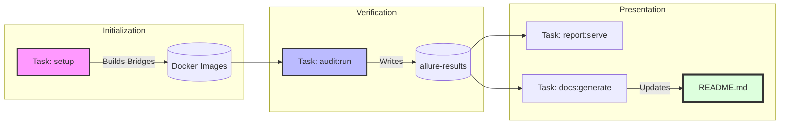

# 🛠️ Operations & Developer Guide

## 1. Executive Overview

This project leverages **Task** (`Taskfile.yml`) as its canonical automation orchestrator. The decision to standardize on Task—over traditional `Makefile`s or a collection of disparate shell scripts—is a deliberate architectural choice designed to enforce clarity, discoverability, and maintainability across all development and CI/CD workflows.

### Core Principles
The primary goals of this system are to:
-   **Eliminate Ambiguity:** Provide a single, authoritative entry point (`task <command>`) for all operational tasks.
-   **Maximize Discoverability:** Enable any developer to instantly see all available workflows with `task --list-all`.
-   **Enforce Separation of Concerns:** Isolate domain-specific logic (e.g., infrastructure vs. testing) into modular, self-contained files.
-   **Ensure Reproducibility:** Guarantee that automation behaves identically on developer machines and in CI pipelines.

### Task Hierarchy & Modular Design
Our automation architecture is not monolithic. It is composed of a central orchestrator and several domain-specific modules, promoting scalability and ease of maintenance.

-   **The Root `Taskfile.yml` (The Orchestrator):** This file serves as the public API for developers. It defines high-level, user-facing commands (e.g., `setup`, `run-v2`) and global project variables. It uses the `includes` directive to delegate the low-level implementation details to specialized modules.

-   **The Modular Taskfiles (`tasks/*.yml`):** Each file within the `tasks/` directory encapsulates the logic for a single operational domain. This design prevents the root Taskfile from becoming bloated and makes it easier to modify or debug specific parts of the automation pipeline without affecting others.

The relationship is as follows:

| Namespace | Responsibility | Source File |
| :--- | :--- | :--- |
| `infra:` | Manages Dockerized test harnesses (Allure Bridges). | `tasks/Taskfile.infra.yml` |
| `audit:` | Executes Pytest suites against FIPS containers. | `tasks/Taskfile.audit.yml` |
| `report:` | Generates and serves static HTML test artifacts. | `tasks/Taskfile.report.yml` |

This layered architecture ensures that our automation is scalable, maintainable, and easy for new developers to navigate.


## 2. Architecture & Orchestration

The automation layer is engineered as a decoupled, modular ecosystem. Rather than a linear script, it functions as an orchestration engine where specialized modules interact through well-defined interfaces (shared directories and environment variables).

### 2.1 Modular Design Philosophy
The system is partitioned into four primary domains, each isolated within its own namespace. This separation ensures that changes in the reporting logic do not inadvertently break the infrastructure or auditing logic.

*   **`infra` (The Environment Layer):** Encapsulates the "Bridge" architecture. It treats reporting tools (Allure) as ephemeral infrastructure, containerizing them to ensure version consistency across all developer environments.
*   **`audit` (The Execution Layer):** The core engine of the project. It handles the invocation of the Pytest suite. It is designed to be "Image Agnostic," meaning it can inject different container targets (`distroless` vs. `standard`) into the same test logic.
*   **`report` (The Visualization Layer):** Responsible for transforming raw JSON/XML test results into human-readable insights. It abstracts the complexity of Docker volume mounting and port mapping, providing a seamless "Serve" experience.
*   **`docs` (The Knowledge Layer):** The final stage of the pipeline. It aggregates performance data, test metrics, and GitHub metadata to synchronize the project's documentation (`README.md` and `docs/`) with the actual state of the code.

### 2.2 Orchestration & Dependency Graph
To maintain system integrity, the `Taskfile` enforces a strict execution order. While many tasks can be run in isolation for debugging, the production pipeline follows a **Directed Acyclic Graph (DAG)** to ensure prerequisites are met.

#### The Core Dependency Chain:
1.  **Provisioning Phase (`infra`):** Before any audit can occur, the `setup` task ensures that the Allure Bridge images exist.
2.  **Validation Phase (`audit`):** Once the infrastructure is ready, the audit engine executes. It generates raw data artifacts in the `allure-results/` directory.
3.  **Synthesis Phase (`report` / `docs`):** These tasks depend on the presence of the audit artifacts. They consume the raw data to produce the final HTML reports and Markdown documentation.

#### Visualizing the Flow:


### 2.3 Variable Propagation & State
State is managed across modules using two primary mechanisms:
*   **Static Variables:** Defined in the root `vars:` section (e.g., `registry`, `owner`), ensuring a "Single Source of Truth" for project-wide constants.
*   **Dynamic Artifacts:** Modules communicate by passing files through standardized directories (`allure-results/`, `allure-report/`). This allows the `report` module to remain independent of the `audit` module’s internal logic—it only cares that the results directory exists and contains valid data.


---

## 3. Stage 01: Environment Bootstrapping

Before executing the verification suites, the local environment must be provisioned with the necessary "Bridges." These are containerized versions of our reporting and auditing tools, ensuring we don't pollute the host system with specific version dependencies.

### 3.1 Local Toolchain Prerequisites
To interface with the automation engine, ensure the following are installed on your host:
- **Task (Go-Task):** The orchestrator (`brew install go-task`).
- **Docker:** Required for running the Wolfi images and the Allure Bridges.
- **Python 3.10+ & Pipenv:** Required for the metadata generation and README update scripts.

### 3.2 Infrastructure as Code: The Allure Bridges
We utilize a "Bridge Architecture" for our reporting. Instead of requiring you to install Java or the Allure CLI locally, we encapsulate these in lightweight Docker images:
- **`allure2-bridge`**: Optimized for standard reporting.
- **`allure3-bridge`**: Used for advanced visualization and analytics.

To build these harnesses, run the primary setup command:
```bash
# Orchestrates the building of both Allure v2 and v3 bridge images
task setup
```

### 3.3 Dependency Management (Python)
Our documentation and benchmarking logic rely on specialized Python scripts. We use `pipenv` to manage a deterministic virtual environment.

```bash
# Initialize the Python environment and install locked dependencies
pipenv install
```

### 3.4 Why This Stage is Critical
1. **Version Pinning:** By building the bridges locally via `infra:build-all`, we guarantee that the report generation logic is identical across the entire team.
2. **Isolation:** No Allure or Java binaries are needed on your host machine; everything runs within an isolated Docker context.
3. **Readiness:** Once this stage is complete, the system enters a "Ready" state, allowing for the execution of the `audit:` and `report:` tasks.

---

> [!NOTE]
> *   **Infrastructure-as-Tooling:** We treat our reporting tools as part of the infrastructure. If the bridge doesn't exist, the pipeline shouldn't proceed.
> *   **Idempotency:** The `setup` task is idempotent; you can run it multiple times, and it will only rebuild images if the underlying Dockerfiles or context have changed.
>
> 


---

## 4. Stage 02: Verification & Auditing

The auditing engine is built on top of `pytest` and is designed to be completely decoupled from the container lifecycle. It treats the target image as an external dependency, allowing for high-velocity testing across multiple environments.

### 4.1 Single Image Audit (Default Workflow)
This is the standard entry point for developers. It executes the full suite of FIPS compliance tests against the pre-defined production-grade image (usually the `distroless` variant).

```bash
# Executes tests against the image defined in DEFAULT_IMAGE
task audit:run
```

**What happens under the hood:**
1.  The system identifies the target image.
2.  A temporary environment is provisioned to execute `pytest`.
3.  Test results and an `environment.properties` file are generated inside the `allure-results/` directory for downstream reporting.

### 4.2 Multi-Variant Testing (The Matrix)
In high-assurance environments, we must ensure that security properties are consistent across all distribution flavors. The `multi` task automates the validation of both the hardened `distroless` image and the `standard` (shell-enabled) image in a single execution loop.

```bash
# Validates both image variants sequentially
task audit:multi
```

**Technical Rationale:**
*   **Standard Image:** Validates that the FIPS module works in interactive/CI environments.
*   **Distroless Image:** Validates the final production artifact where the attack surface is minimized.

### 4.3 Runtime Overrides & CLI Flexibility
The audit system is engineered for "Injection." You can point the audit suite at any image—whether it’s a local build or a remote staging image—without modifying the `Taskfile`.

**Pattern: Overriding via Environment Variables**
```bash
# Run the audit against a specific local tag or remote registry
task audit:run IMAGE="ghcr.io/your-org/wolfi-openssl:debug-feat-x"
```

**The `SAFE_NAME` Logic (Technical Detail):**
To prevent data collision when testing multiple images, the Taskfile employs a sanitization logic:
```yaml
SAFE_NAME: '{{.IMG_SAFE | replace "/" "_" | replace ":" "_" | replace "." "_"}}'
```
This ensures that results for `ghcr.io/repo:latest` are stored in `allure-results/audit_ghcr_io_repo_latest/`. This allows you to run audits for multiple versions and compare them in a single Allure report without overwriting data.

### 4.4 Result Persistence
Every audit run generates a structured output:
*   **`allure-results/`**: Contains the raw JSON/XML data.
*   **`environment.properties`**: Dynamically generated during the run to inject the exact Image ID into the final report, ensuring full traceability from "Test Result" to "Container Binary."

---
## 5. Stage 03: Reporting & Observability

In high-compliance environments (FIPS 140-3), a "passed test" is only as good as its documentation. This stage abstracts the complexity of data visualization using a **Bridge Architecture**, allowing us to generate high-fidelity reports without host-side dependencies.

### 5.1 The Reporting Philosophy: "Data vs. Insights"
Our pipeline generates massive amounts of raw JSON and XML artifacts during the `audit` stage. Stage 03 is responsible for the **Synthesis** of this data. We treat our reporting infrastructure as ephemeral; the reports are generated on-demand inside isolated containers to ensure that the visualization logic remains consistent regardless of where the developer is working.

### 5.2 Dual-Engine Support: Allure v2 vs. Allure v3
We provide two distinct reporting engines to cater to different operational needs:

*   **Allure v2 (The Industry Standard):** Best for stable, daily compliance checks. It provides a proven, highly-compatible UI that security auditors are familiar with.
    *   *Command:* `task run-v2` (Orchestrates Audit + Serve)
*   **Allure v3 (Advanced Analytics):** Leveraged for deep-dive performance analysis and complex multi-test trend visualization. It offers a more modern reactive UI for inspecting cryptographic execution timings.
    *   *Command:* `task run-v3` (Orchestrates Audit + Serve)

### 5.3 The Bridge Abstraction (Containerized Reporting)
To maintain a "Zero-Install" policy on host machines, we use **Dockerized Bridges**. These bridges handle the complex Java/Node environments required by Allure:
1.  **Mounting:** The `allure-results/` directory is mounted as a read-only volume into the bridge container.
2.  **Transformation:** The bridge binary parses the raw results and compiles a static, single-page application (SPA).
3.  **Serving:** A micro-web server is spawned inside the container, mapped to host ports (`8080` or `8081`), allowing the developer to interact with the report via a local browser.

### 5.4 Multi-Audit Aggregation (The "Single Pane of Glass")
One of the most powerful features of our orchestration is the ability to aggregate results from different image variants (`standard` vs. `distroless`) into a single report.

By using the globbing pattern `{{.RESULTS_DIR}}/audit_*`, the reporting engine automatically discovers every test session executed in the current workspace. This allows auditors to:
*   Compare FIPS compliance across different base OS versions side-by-side.
*   Identify if a specific vulnerability or failure is restricted to the `distroless` environment or is a core `OpenSSL` issue.

### 5.5 Critical Observability Metrics
Our reports are configured to highlight the following **KPIs (Key Performance Indicators)**:
*   **Cryptographic Boundary Integrity:** Did the FIPS provider load correctly?
*   **Algorithm Blocking:** Confirmation that non-approved algorithms (e.g., MD5 in FIPS mode) were successfully rejected.
*   **KAT (Known Answer Tests) Latency:** Timing metrics for self-tests to ensure no performance regressions in the cryptographic engine.

### 5.6 Manual Lifecycle Management
While `task run-v2` is the standard "one-shot" command, senior engineers can control the lifecycle manually:
```bash
# Generate the report without opening a browser (useful for CI artifacts)
task report:v2:gen

# Serve existing results from a previous CI run downloaded locally
task report:v2:serve
```

---
> [!INFO]
> ### 💡 Strategic Insight:
> "By decoupling the **Audit** (Data Generation) from the **Report** (Data Visualization), we create a 'Tamper-Evident' workflow. The reporting bridge ensures that the data is presented exactly as it was captured, providing a reliable 'Chain of Custody' for our FIPS compliance artifacts."


---

## 6. Stage 04: Performance & Benchmarking

The benchmarking pipeline is designed to provide empirical evidence of the operational efficiency of the Wolfi-OpenSSL FIPS stack. We move beyond "it works" to "it performs at scale," ensuring that security hardening does not become a bottleneck for cloud-native workloads.

### 6.1 The Benchmarking Philosophy: "Quantifying the FIPS Tax"
Running OpenSSL in FIPS mode involves additional entropy gathering and algorithmic constraints. Our goal is to benchmark the **Delta** between standard execution and FIPS-validated execution across various ciphers (AES-GCM, RSA, ECDSA, etc.).

### 6.2 The Profiling Engine (`run_benchmark.sh`)
The core workload is driven by the `docs:benchmark` task. This engine executes a series of `openssl speed` commands within the target container environment. 
*   **Parallelism Control:** Benchmarks are executed in controlled environments to minimize "Noisy Neighbor" interference.
*   **Standardization:** We measure throughput (bytes per second) and latency (operations per second) for varying buffer sizes (16b to 16kb) to simulate real-world packet sizes.

### 6.3 Automated Data Parsing (`parser.py`)
Raw OpenSSL output is notoriously difficult to consume (ASCII tables). Our `docs:parse-benchmark` task utilizes a specialized Python-based parser to:
1.  **Extract:** Scrape the raw logs for specific algorithmic metrics.
2.  **Normalize:** Convert various units (kibi-bytes vs kilo-bytes) into a standardized SI format.
3.  **Structure:** Transform the unstructured text into a machine-readable JSON/CSV intermediate state. This allows us to track performance regressions over time across different versions of the FIPS provider.

### 6.4 Statistical Synthesis & Reporting
The final phase, `docs:all-report-benchmark`, aggregates the parsed data and invokes a Python-based reporting engine (`generate_report.py`) to produce high-fidelity visualizations.

*   **Regression Analysis:** The system is designed to compare the current build's performance against historical baselines.
*   **Heatmaps & Throughput Curves:** Instead of single data points, we generate curves that show how the FIPS provider scales with larger data chunks—critical for high-throughput TLS termination proxies.

### 6.5 Operational Commands
To trigger the full performance profiling and reporting pipeline:

```bash
# Complete End-to-End Pipeline: Run -> Parse -> Report
task docs:all-report-benchmark
```

For granular control, you can execute individual stages:
```bash
# Step 1: Execute the raw benchmark workloads
task docs:benchmark

# Step 2: Transform raw logs into structured data
task docs:parse-benchmark
```

### 6.6 Performance Metadata
Every benchmark report is tagged with:
*   **CPU Instruction Sets:** (e.g., AES-NI, AVX-512) to verify if the FIPS provider is correctly utilizing hardware acceleration.
*   **Kernel Version:** To account for syscall overhead in the containerized environment.
*   **OpenSSL Build Flags:** To ensure the performance is reflective of the production configuration.

---

> [!INFO]
> ### 💡 Strategic Insight:
> "We don't benchmark to see how fast we are; we benchmark to detect **Regressions**. In the world of FIPS, a sudden 5% drop in throughput often points to a change in the cryptographic boundary or a loss of hardware acceleration—both of which have security and cost implications at scale."