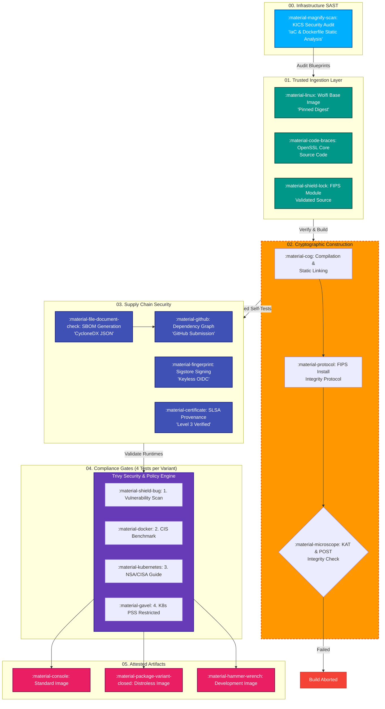

# 🏛️ System Architecture & Integrity

Our build pipeline enforces a strict cryptographic boundary, ensuring that the **FIPS 140-3 module** is correctly installed, initialized, and protected from tampering.

We rely on a **Hermetic Build** philosophy. This means zero external dependencies at build time, byte-for-byte reproducibility, and SLSA Level 3 provenance.

---

## :material-lock-pattern: The Cryptographic Boundary

The following architecture diagram illustrates the flow from trusted source ingestion down to the attested deployment artifacts. 

!!! info "Runtime Integrity Check (FIPS POST)"
    The FIPS POST (Power-On Self-Test) happens automatically on startup. If the `.so` binary is tampered with, the MAC verification fails and the container halts immediately.

---

## :material-shield-check: Deployment Variants

We provide specialized variants optimized for security and operational flexibility.

| Variant | Image Tag | Base OS | Intended Use Case |
| :--- | :--- | :--- | :--- |
| **Standard** | `{{ core_version }}` | Wolfi | Includes shell (`/bin/bash`) for debugging and CI pipelines. |
| **Distroless** | `{{ core_version }}-distroless` | Static | No shell/manager. Pure cryptographic engine for production. |
| **Development** | `{{ core_version }}-dev` | Wolfi (Dev) | Includes build tools (`gcc`, `make`) for compiling apps. |

